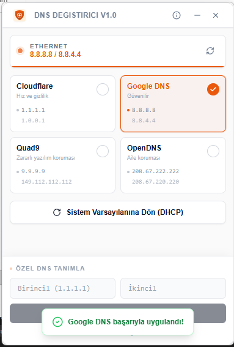
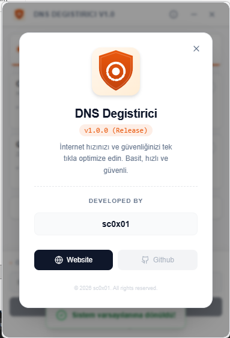

# 🛡️ DNS Degistirici v1.0

**[sc0x01.com](https://sc0x01.com)** tasarım felsefesiyle geliştirilmiş, minimalist, hızlı ve güvenli DNS değiştirme aracı. Gereksiz hiçbir detay içermez, sadece en hızlı ve güvenli internet deneyimini sunar.

---

## 🚀 Temel Özellikler

- **🔒 Hız ve Gizlilik:** Cloudflare, Google, Quad9 ve OpenDNS arasında tek tıkla geçiş yapın.
- **🛡️ Güvenlik Odaklı:** Zararlı yazılımlardan (Quad9) veya uygunsuz içeriklerden (OpenDNS Aile) korunun.
- **⚡ Arka Plan Çalışma (System Tray):** Uygulamayı kapatmadan sistem tepsisine (`Tray`) küçültebilir, sağ tık menüsünden anında DNS değiştirebilirsiniz.
- **🔔 Anlık Bildirimler:** DNS değişimleri hakkında Windows bildirimleri ile anında haberdar olun.
- **🤖 Otomatik (DHCP):** Tek tıkla orijinal sistem varsayılan ayarlarına geri dönün.
- **🎨 Modern Arayüz:** Sade, şık ve kullanımı kolay arayüz.

## 📸 Ekran Görüntüleri

  
  
  

## 🛠️ Teknik Altyapı

- **Frontend:** React + TypeScript + Tailwind CSS (Yüksek performanslı UI)
- **Backend:** Rust (Tauri v2) - Sistem kaynaklarını yormaz (< 10MB RAM)
- **Güvenlik:** Windows `netsh` ve `powershell` komutlarını güvenli bir şekilde yönetir.

## 📥 Kurulum ve Kullanım

1. [Releases](https://github.com/sc0x01/dns-degistirici/releases) sayfasından en güncel `.exe` dosyasını indirin.
2. İndirdiğiniz dosyayı çalıştırın (Yönetici izni gereklidir).
3. İstediğiniz DNS sağlayıcısını seçin (örn: Cloudflare).
4. **"Başarıyla Uygulandı"** bildirimini görünce işlem tamamdır!
5. Uygulamayı kapattığınızda sistem tepsisinde arka planda çalışmaya devam eder.

> **Not:** Windows DNS ayarlarını değiştirebilmek için uygulamanın **"Yönetici Olarak Çalıştırılması"** gerekir. Eğer yönetici değilseniz, uygulama sizi uyaracaktır.

---

## 🛡️ Güvenlik ve Gizlilik Notu

Bu uygulama, internet bağlantı ayarlarınızı değiştirmek için standart Windows ağ komutlarını (`netsh`, `ipconfig`) kullanır. Hiçbir verinizi toplamaz, izlemez veya üçüncü taraflarla paylaşmaz. Kaynak kodları bu repoda %100 şeffaf bir şekilde paylaşılmıştır.

---

> **"Basitlik karmaşıklığın en üst noktasıdır."**  
> Geliştirilen: [sc0x01.com](https://sc0x01.com)
